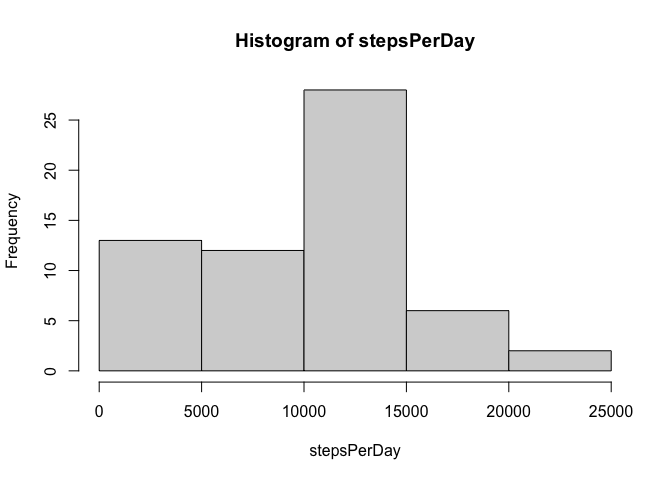
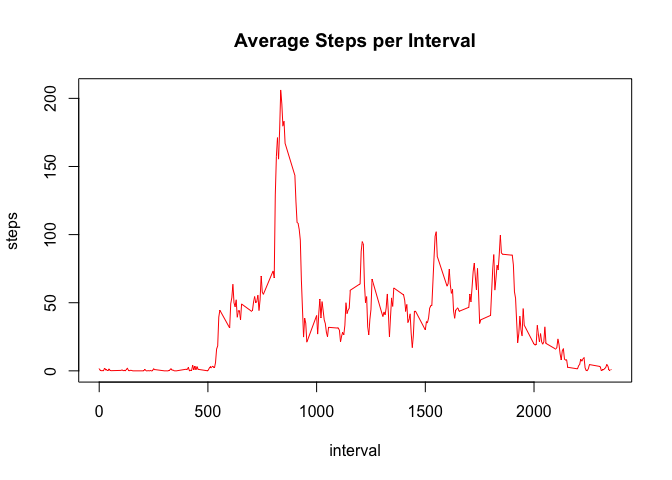
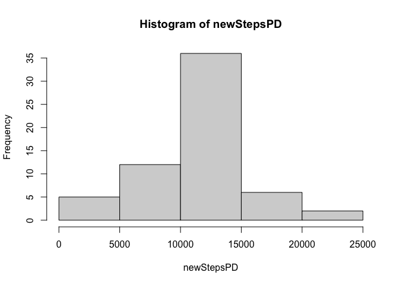
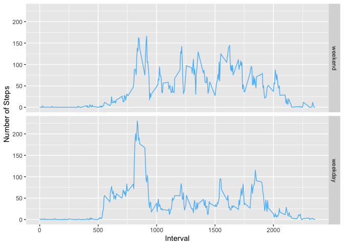

---
title: "PA1 Activity Monitor Analysis"
output: 
  html_document:
    keep_md: true
---

By Whitney Light


### Loading and preprocessing 

The first step is to load the activity monitor data and take a look at it.  


```r
data <- read.csv("activity.csv")
head(data)
```

```
##   steps       date interval
## 1    NA 2012-10-01        0
## 2    NA 2012-10-01        5
## 3    NA 2012-10-01       10
## 4    NA 2012-10-01       15
## 5    NA 2012-10-01       20
## 6    NA 2012-10-01       25
```
Step two is to make the data easy to work with:  
  - Convert the data column to date format using lubridate.  
  - Convert the dataframe into a tibble using dplyr.  


```r
library(lubridate)
```

```
## 
## Attaching package: 'lubridate'
```

```
## The following objects are masked from 'package:base':
## 
##     date, intersect, setdiff, union
```

```r
data$date <- ymd(data$date)

library(dplyr)
```

```
## 
## Attaching package: 'dplyr'
```

```
## The following objects are masked from 'package:lubridate':
## 
##     intersect, setdiff, union
```

```
## The following objects are masked from 'package:stats':
## 
##     filter, lag
```

```
## The following objects are masked from 'package:base':
## 
##     intersect, setdiff, setequal, union
```

```r
data <- as_tibble(data)
```

### What is the mean total number of steps taken per day?

Let's create a histogram of the total number of steps taken each day.  


```r
stepsPerDay <- with(data, tapply(steps, date, sum, na.rm=TRUE))
hist(stepsPerDay)
```

<!-- -->

Find the **mean** and the **median** of steps taken per day.  


```r
summary(stepsPerDay)
```

```
##    Min. 1st Qu.  Median    Mean 3rd Qu.    Max. 
##       0    6778   10395    9354   12811   21194
```

### What is the average daily activity pattern?

Find the average steps per interval across all days, and plot it as a time series.  


```r
stepsPerInterval <- data[ , c("steps", "interval")] %>%
        group_by(interval) %>%
        summarise_all( mean, na.rm=TRUE)

with(stepsPerInterval, plot(interval, steps, type='l', col="red", main="Average Steps per Interval"))
```

<!-- -->

Locate the interval with the highest number of steps on average.  


```r
max <- which.max(stepsPerInterval$steps)
stepsPerInterval[max, ]
```

```
## # A tibble: 1 x 2
##   interval steps
##      <int> <dbl>
## 1      835  206.
```
Interval 835 appears to contain the highest number of steps on average.  

### Imputing missing values

Calculate the total number of missing values in the data.  


```r
sum(is.na(data$steps))
```

```
## [1] 2304
```
Fill the missing values with the average number of steps in the corresponding 
five-minute interval.  


```r
newdata <- data %>%
        group_by(interval) %>%
        mutate(steps=ifelse(is.na(steps), mean(steps, na.rm=TRUE), steps))
```

Use the new dataset to plot a histogram of total steps by date.  


```r
newStepsPD <- with(newdata, tapply(steps, date, sum, na.rm=TRUE))
hist(newStepsPD)
```

<!-- -->

Have a look at the new **mean** and **median**, and compare it to the results before imputing the NAs.


```r
summary(newStepsPD)
```

```
##    Min. 1st Qu.  Median    Mean 3rd Qu.    Max. 
##      41    9819   10766   10766   12811   21194
```

```r
summary(stepsPerDay)
```

```
##    Min. 1st Qu.  Median    Mean 3rd Qu.    Max. 
##       0    6778   10395    9354   12811   21194
```

The mean and the median have increased after imputing the NAs. This makes sense,   since the minimum number of steps per day is now 41, rather than 0.  

### Are there differences in activity between weekdays and weekends?  

First, create a new factor variable indicating whether the observation occurred  
on a weekday or weekend.


```r
weekdays1 <- c('Monday','Tuesday','Wednesday','Thursday','Friday')

newdata$Day <- factor((weekdays(newdata$date) %in% weekdays1),
                      levels=c(FALSE, TRUE), labels=c('weekend','weekday'))
```

Now create a time series graph comparing the average steps per interval on weekends versus weekdays.


```r
library(ggplot2)

stepsPI <- newdata %>%
        group_by(Day, interval) %>%
        summarise(avgSteps=mean(steps))

ggplot(data=stepsPI, mapping=aes(interval, avgSteps, group=Day)) + geom_line(color="#59bbf7") + facet_grid(Day ~ .) + ylab("Number of Steps") + xlab("Interval")
```

<!-- -->

The graph suggests that this individual is more active overall on the weekend, although on weekday mornings they get moving at an earlier time of day. This makes sense if the person has a weekday commute to school or work, for example.  

The end. 


